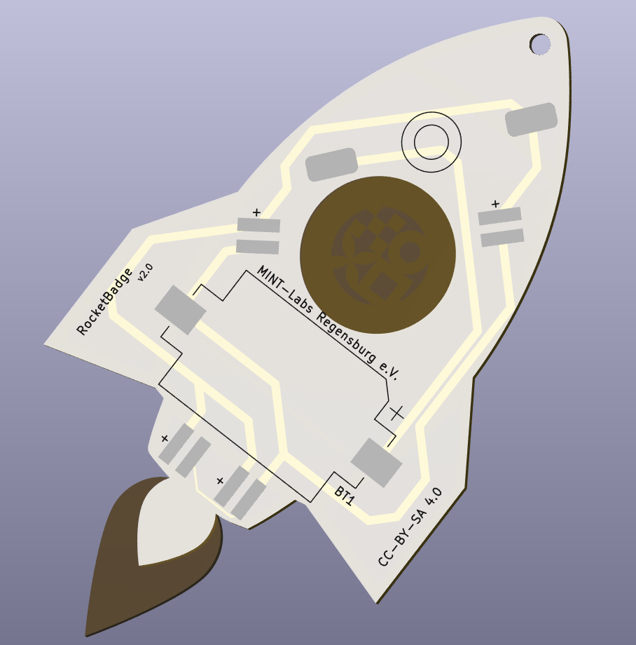

# Mint-Labs Rocket

To the moon! With this wonderful Mint-Labs Rocket and its rainbow-impulsion!

 

- Status: **Complete**
- Difficulty: **2/5**

### Parts List

| Description                   | Quantity |
|-------------------------------|----------|
| RGB LEDs 5mm                  |     4    |
| Button (SMD)                  |     1    |
| Switch			|     1	   |
| CR2032 Battery Holder (SMD)   |     1    |
| CR2032 Battery (not included) |     1    |

### Manual
You can find the manual and pictures of every step here: https://github.com/Binary-Kitchen/SolderingTutorial

### Copyright and Authorship

- Board: [CC-BY-SA 4.0](https://creativecommons.org/licenses/by-sa/4.0/) - [Timo from blinkyparts.com](https://shop.blinkyparts.com)
- Unicorn SVG [CC-BY-SA](https://creativecommons.org/licenses/by-sa/4.0/) - [Rocket by Jean-Philippe Cabaroc](https://thenounproject.com/icon/rocket-7427/) (We've bought a licence, you should honor the artist work too!)

### Buy Soldering Kits
If you want to buy the parts and PCB for a soldering kit you can find everything here: [Rocket @ shop.blinkyparts.com](https://shop.blinkyparts.com/de/Regenbogen-Rakete-Ein-Loetbausatz-nicht-von-dieser-Welt/blink234942)
